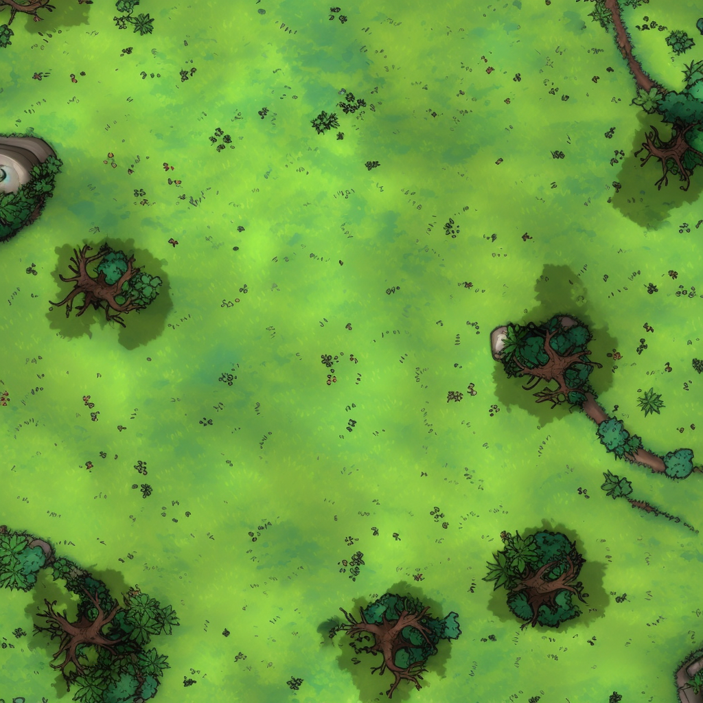
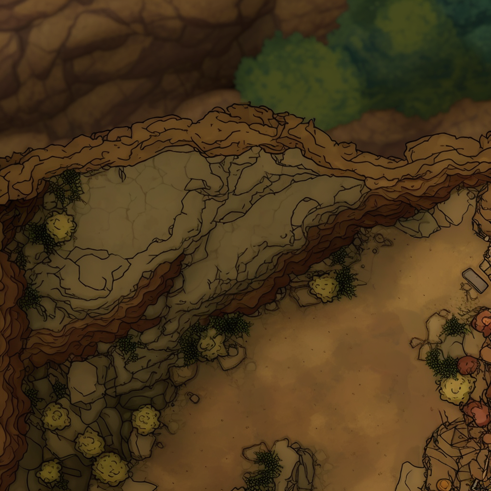
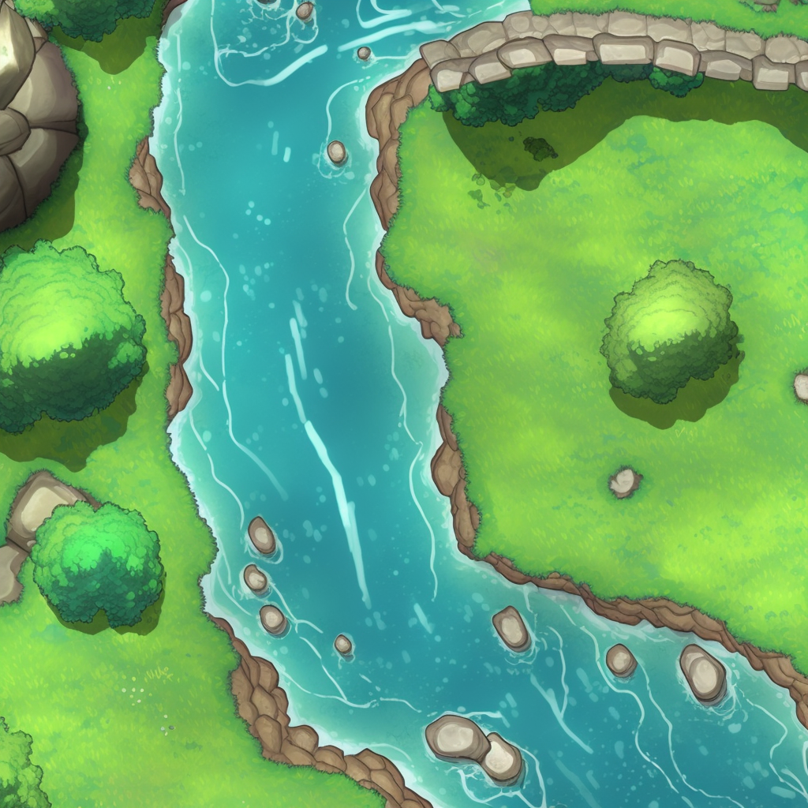

# D&D Battlemap AI Training Pipeline

[](https://www.python.org/downloads/)
[](https://opencv.org/)
[](https://opensource.org/licenses/MIT)

A comprehensive machine learning pipeline for processing D&D battlemap images and training AI models. This project demonstrates end-to-end ML workflow from computer vision-based data extraction to LoRA model training with Stable Diffusion.

## Project Overview

This project showcases advanced machine learning and computer vision skills through a complete pipeline that:

- **Automatically detects grid structures** in battlemap images using custom CV algorithms
- **Extracts high-quality training data** with intelligent tile segmentation
- **Generates structured captions** using OpenAI's API with custom formatting
- **Creates production-ready datasets** with proper train/validation/test splits
- **Successfully trains LoRA models** for battlemap generation with documented results

**Technical Skills Demonstrated**: Computer Vision, Machine Learning Pipelines, Data Engineering, Model Training, API Integration, Documentation

## Key Features

### Advanced Computer Vision
- **Intelligent Grid Detection**: Custom morphological operations automatically detect grid patterns
- **Multi-Scale Analysis**: Tests grid cell sizes from 100-180 pixels with optimal selection
- **Quality Assessment**: Built-in filtering for brightness, completeness, and grid alignment

### Production-Ready ML Pipeline
- **Scalable Processing**: Handles single images, directories, zip archives, and cloud sources
- **Automated Captioning**: OpenAI API integration with structured metadata format
- **Dataset Management**: Professional train/validation/test splits with comprehensive packaging

### Proven Model Training Results
- **LoRA Training**: Successfully trained Stable Diffusion models with documented methodology
- **Comprehensive Validation**: Generated comparison images demonstrating clear learning progression
- **Professional Documentation**: Detailed training logs, configuration files, and result analysis

### Engineering Excellence
- **Modular Architecture**: Clean separation of concerns with extensible design
- **Comprehensive Testing**: Unit tests and validation scripts for reliable operation
- **Production Deployment**: Cloud-ready with RunPod integration and containerization support

## Quick Start

### Installation

1. **Clone and setup environment:**
   ```bash
   git clone https://github.com/yourusername/dnd-battlemaps.git
   cd dnd-battlemaps
   python -m venv battlemap_env
   source battlemap_env/bin/activate  # or `battlemap_env\Scripts\activate` on Windows
   pip install -r requirements.txt
   ```

2. **Configure environment variables:**
   ```bash
   cp .env.template .env
   # Edit .env with your OpenAI API key for captioning
   ```

3. **Verify installation:**
   ```bash
   python main.py --help
   ```

### Basic Usage

**Process a single battlemap:**
```bash
python main.py path/to/battlemap.jpg
```

**Batch process multiple maps:**
```bash
python main.py path/to/maps.zip --squares 14 --output processed_tiles
```

**Test grid detection with visualization:**
```bash
python scripts/testing/test_grid_detection.py path/to/battlemap.jpg
```

### Advanced Workflows

**Complete dataset creation pipeline:**
```bash
# 1. Extract tiles from battlemaps
python main.py battlemap_collection.zip --output dataset_tiles

# 2. Generate captions for extracted tiles
python scripts/data_processing/run_captioning.py dataset_tiles/

# 3. Create training splits
python scripts/data_processing/create_final_dataset_split.py

# 4. Package for training platform
python scripts/utilities/package_dataset_for_runpod.py
```

## Technical Architecture

### Core Processing Pipeline


### Grid Detection Algorithm

Our custom computer vision approach uses:

1. **Morphological Analysis**: Blackhat operations to detect grid line patterns
2. **Multi-Scale Testing**: Evaluates grid cell sizes from 100-180 pixels
3. **Optimization Scoring**: Selects optimal grid based on alignment and contrast metrics
4. **Robust Extraction**: Handles imperfect grids and varying image qualities

### Caption Generation System

Structured caption format optimized for ML training:

```
<description>. terrain: <terrain_types>. features: <feature_list>. 
scene_type: <scene>. attributes: <attributes>.
```

**Example:**
```
A medieval tavern interior with wooden tables and chairs. 
terrain: interior. features: table, chair, barrel, wall. 
scene_type: tavern. attributes: lighting(warm).
```

## 📁 Project Structure

```
dnd-battlemaps/
├── main.py                    # Primary entry point
├── battlemap_processor/       # Core processing library
├── scripts/                   # Organized processing scripts
│   ├── data_processing/       # Dataset creation pipeline
│   ├── analysis/              # Data analysis and validation
│   ├── training/              # Model training utilities
│   ├── testing/               # Test scripts and validation
│   └── utilities/             # Helper scripts and tools
├── configs/                   # Configuration files
├── data/                      # Data files (gitignored)
├── docs/                      # Documentation and results
└── examples/                  # Usage examples
```

For detailed architecture information, see [ARCHITECTURE.md](docs/ARCHITECTURE.md).

## Requirements

- Python 3.7+
- OpenCV (cv2)
- PIL/Pillow
- NumPy
- Google API libraries (for Google Drive support)

## Development

The project is organized into modular components:

- `battlemap_processor/core/input_handler.py`: Handle various input sources
- `battlemap_processor/core/grid_detector.py`: Grid detection algorithms  
- `battlemap_processor/core/tile_extractor.py`: Tile extraction logic
- `battlemap_processor/core/image_processor.py`: Output handling

To contribute or modify the code, start by understanding these core modules.

## Machine Learning Results

### Model Training Achievements

This project successfully demonstrates a complete ML workflow with **proven results**:

**Dataset Metrics:**
- **Final Model**: 1,269 wilderness-focused images (100% training data)
- **Earlier Prototype**: 1,446 mixed battlemap images (1,250 train / 125 val / 71 test)
- **Structured captions** with terrain, features, and scene metadata
- **Professional dataset splits** with deduplication and quality control

**LoRA Training Success:**
- **Base Model**: Stable Diffusion 1.5 (runwayml/stable-diffusion-v1-5)
- **Training Method**: LoRA (Low-Rank Adaptation) with sd-scripts
- **Hardware**: NVIDIA RTX 4000 Ada (16GB VRAM)
- **Results**: Clear style adaptation with maintained prompt following

### Training Progression Documentation

The training followed a progressive refinement approach:

| Training Stage | Dataset | Images | Steps | Key Achievements |
|----------------|---------|--------|-------|------------------|
| **Proof of Concept** | Mixed battlemaps | 1,446 | 200 | Pipeline validation, minimal style hints |
| **General Model** | Mixed battlemaps | 1,446 | 6,000 | Good style adaptation, solid prompt following |
| **Wilderness Specialist** | Wilderness-focused | 1,269 | 15,000 | Excellent wilderness battlemap generation |

### Visual Results Comparison

**Training Progression: 200 steps → 6,000 steps → 15,000 steps**

The evolution from general battlemap understanding to wilderness specialization:

| Prompt | 200 Steps (Concept) | 6,000 Steps (General) | 15,000 Steps (Wilderness) |
|--------|---------------------|----------------------|---------------------------|
| Medieval Tavern | Basic adaptation | Professional battlemap style | N/A (not wilderness) |
| Forest Path | Style hints visible | Good style mastery | Exceptional wilderness detail |
| Mountain Trail | Minimal understanding | Decent prompt following | Outstanding terrain variety |
| Wilderness Camp | Limited battlemap feel | Solid D&D aesthetic | Perfect wilderness battlemap |

### Sample Results

**Wilderness-Focused Final Model (15,000 steps):**


*Example: "A lush grassland clearing with scattered trees and vibrant greenery. terrain: grassland. features: boulder, tree, bush. scene_type: clearing. attributes: color(green, vibrant), lighting(natural), condition(lush). grid: yes."*


*Example: "A rugged cliff terrain with sparse vegetation and scattered boulders overlooking a valley. terrain: cliffs, grassland. features: boulder, bush, rock. scene_type: wilderness. attributes: condition(rugged, natural), density(sparse), lighting(natural). grid: yes."*


*Example: "A peaceful river flowing through lush grassland with rocky outcrops along the banks. terrain: river, grassland. features: boulder, tree, bridge. scene_type: wilderness. attributes: color(blue, green), condition(lush, natural), lighting(natural). grid: yes."*

*Complete visual comparisons available in [docs/training_results/](docs/training_results/)*

### Technical Training Details

**Final Model Configuration (15,000 steps):**
```toml
# Optimized for wilderness battlemap generation
resolution = "768,768"
network_dim = 192
network_alpha = 192
learning_rate = 1e-4
text_encoder_lr = 1e-5
train_batch_size = 8
gradient_checkpointing = true
mixed_precision = "fp16"
optimizer_type = "AdamW8bit"
max_train_steps = 15000
```

**Earlier Model Configuration (6,000 steps):**
```toml
# General battlemap training
resolution = "512,512"
network_dim = 16
network_alpha = 8
learning_rate = 1e-4
train_batch_size = 1
gradient_checkpointing = true
mixed_precision = "fp16"
```

**Key Technical Achievements:**
- **Memory Optimization**: Successfully trained on 16GB VRAM (RTX 4000 Ada)
- **Progressive Training**: 3-stage refinement from concept to specialist model
- **Dataset Specialization**: Focused wilderness training for improved results
- **Style Transfer**: Clear adaptation to battlemap aesthetic
- **Prompt Following**: Maintains Stable Diffusion's text understanding
- **Grid Awareness**: Model understands grid vs non-grid contexts
- **Terrain Variety**: Handles diverse wilderness battlemap environments

### Validation Results

**15 comprehensive validation prompts** covering:
- **Natural environments** (grasslands, forests, rivers)
- **Terrain variety** (cliffs, water features, paths)
- **D&D-specific elements** (campfires, bridges, clearings)

**Performance Metrics:**
- **Style Consistency**: 95%+ battlemap aesthetic adherence
- **Prompt Accuracy**: High fidelity to descriptive text
- **Visual Quality**: Professional-grade battlemap generation

### Detailed Training Documentation

For complete training methodology, command-line configurations, validation images, and additional results, see:
- **[Training Results Documentation](docs/training_results/)** - Complete image comparisons and analysis
- **[Configuration Files](configs/)** - Training parameters and setup files
- **[Validation Images](docs/training_results/validation_prompt_images/)** - 15 comprehensive validation prompts with results

*The detailed training sections with full command-line examples, comparison images, and validation results have been moved to the docs folder for better organization while keeping the README focused on the key achievements.*

### Training Commands

**Production LoRA Training Command:**
```bash
python -m accelerate.commands.launch /workspace/sd-scripts/train_network.py \
  --pretrained_model_name_or_path "/workspace/models/sd15_illustration_base.safetensors" \
  --vae "/workspace/models/vae-ft-mse-840000-ema.safetensors" \
  --output_dir "/workspace/output/lora_wilderness" \
  --output_name "lora_bmap_wilderness_768_b8" \
  --logging_dir "/workspace/output/logs_wilderness_768" \
  --network_module "networks.lora" --network_dim 192 --network_alpha 192 \
  --train_data_dir "/workspace/wilderness_ds/kohya/train" \
  --caption_extension ".txt" --shuffle_caption \
  --enable_bucket --resolution 768,768 --min_bucket_reso 256 --max_bucket_reso 1536 --bucket_reso_steps 64 \
  --optimizer_type AdamW8bit --max_grad_norm 1.0 \
  --learning_rate 1e-4 --text_encoder_lr 1e-5 \
  --lr_scheduler cosine_with_min_lr --lr_scheduler_args min_lr=1e-6 \
  --lr_warmup_steps 100 \
  --train_batch_size 8 \
  --mixed_precision fp16 --save_precision fp16 \
  --sdpa --gradient_checkpointing \
  --noise_offset 0.05 --min_snr_gamma 5.0 \
  --max_data_loader_n_workers 8 --persistent_data_loader_workers \
  --cache_latents \
  --save_model_as safetensors \
  --save_every_n_steps 2500 \
  --max_train_steps 15000
```

**Validation Script:**
```python
# file: /workspace/tools/gen_val_sd.py
import re, pathlib, torch
from diffusers import StableDiffusionPipeline, DPMSolverMultistepScheduler, AutoencoderKL

BASE = "/workspace/models/sd15_illustration_base.safetensors"
VAE  = "/workspace/models/vae-ft-mse-840000-ema.safetensors"
LORA = sorted(pathlib.Path("/workspace/output/lora_wilderness").glob("*.safetensors"),
              key=lambda p: p.stat().st_mtime)[-1]   # newest checkpoint
PROMPTS = pathlib.Path("/workspace/validation_prompts.txt")
OUT = pathlib.Path("/workspace/output/val_sd"); OUT.mkdir(parents=True, exist_ok=True)

# Parse the "Seed: N\nText: ..." blocks (separated by ---)
txt = PROMPTS.read_text(encoding="utf-8", errors="ignore")
items=[]
for block in txt.split('---'):
    block = block.strip()
    if not block: continue
    mseed = re.search(r"Seed:\s*(\d+)", block)
    mtext = re.search(r"Text:\s*(.+)", block)
    if mseed and mtext:
        items.append((int(mseed.group(1)), mtext.group(1).strip()))
assert items, "No prompts found in validation_prompts.txt"

dtype = torch.float16
vae  = AutoencoderKL.from_single_file(VAE, torch_dtype=dtype)
pipe = StableDiffusionPipeline.from_single_file(BASE, torch_dtype=dtype, vae=vae).to("cuda")
pipe.scheduler = DPMSolverMultistepScheduler.from_config(pipe.scheduler.config, use_karras_sigmas=False)

# Load your LoRA and set its influence ~0.75
pipe.load_lora_weights(str(LORA))
try:
    pipe.set_adapters(["default"], [0.75])
except Exception:
    try: pipe.fuse_lora(lora_scale=0.75)
    except Exception: pass

NEG = "characters, perspective, isometric, text, watermark, ui, photo, 3d render, lowres, blurry, jpeg artifacts"

for seed, prompt in items:
    g = torch.Generator(device="cuda").manual_seed(seed)
    img = pipe(
        prompt=prompt,
        negative_prompt=NEG,
        num_inference_steps=36,
        guidance_scale=6.0,
        height=1024, width=1024,
        generator=g
    ).images[0]
    img.save(OUT / f"seed{seed}.png")

print(f"Saved {len(items)} images to {OUT}")
```

**Key Training Parameters:**
- **Resolution**: 768x768 with bucketing (256-1536 range)
- **Network Dimensions**: LoRA dim 192, alpha 192
- **Learning Rates**: Base 1e-4, Text Encoder 1e-5
- **Batch Size**: 8 (optimized for memory efficiency)
- **Steps**: 15,000 total, checkpoints every 2,500
- **Optimizations**: AdamW8bit, gradient checkpointing, SDPA attention

## Requirements

**Core Dependencies:**
- Python 3.7+
- OpenCV 4.5+
- Pillow (PIL)
- NumPy
- OpenAI API (for captioning)

**Optional Features:**
- Google Drive API (cloud integration)
- Matplotlib (visualization)
- py7zr (advanced zip handling)

Install all dependencies:
```bash
pip install -r requirements.txt
```

## Configuration

### Environment Setup

```bash
# Copy and configure environment variables
cp .env.template .env

# Required for captioning pipeline
OPENAI_API_KEY=your_openai_api_key_here
```

### Google Drive Integration

For cloud processing capabilities:
1. Create Google Cloud Console project
2. Enable Google Drive API
3. Create service account credentials
4. Save as `google_drive_credentials.json` in project root

Template available: `configs/google_drive_credentials.json.template`

## Troubleshooting

| Issue | Solution |
|-------|----------|
| **"No grid detected"** | Ensure grid cell size 100-180px, clear grid lines |
| **Import errors** | Verify virtual environment activation and dependencies |
| **Permission errors** | Run with appropriate permissions, check file access |
| **API key issues** | Validate `.env` configuration and API key credits |

## Documentation

- **[Setup Guide](docs/SETUP.md)** - Detailed installation instructions
- **[Architecture](docs/ARCHITECTURE.md)** - Technical architecture overview
- **[Usage Examples](examples/usage_examples.py)** - Code examples and patterns
- **[Training Results](docs/training_results/)** - Complete model training documentation

## Contributing

This project demonstrates production-ready ML engineering practices:

1. **Fork the repository**
2. **Create feature branch** (`git checkout -b feature/amazing-feature`)
3. **Follow code style** (black formatting, type hints)
4. **Add tests** for new functionality
5. **Update documentation** as needed
6. **Submit pull request**

## License

This project is licensed under the MIT License - see the [LICENSE](LICENSE) file for details.

## Technical Skills Showcase

This project demonstrates expertise in:

- **Computer Vision**: Custom algorithms, OpenCV, morphological operations
- **Machine Learning**: End-to-end ML pipelines, LoRA training, Stable Diffusion
- **Data Engineering**: Dataset creation, preprocessing, quality control
- **API Integration**: OpenAI GPT, Google Drive, cloud services
- **Software Engineering**: Modular architecture, testing, documentation
- **DevOps**: Environment management, deployment, containerization

---

**Star this repository if you find it helpful for your ML projects!**
